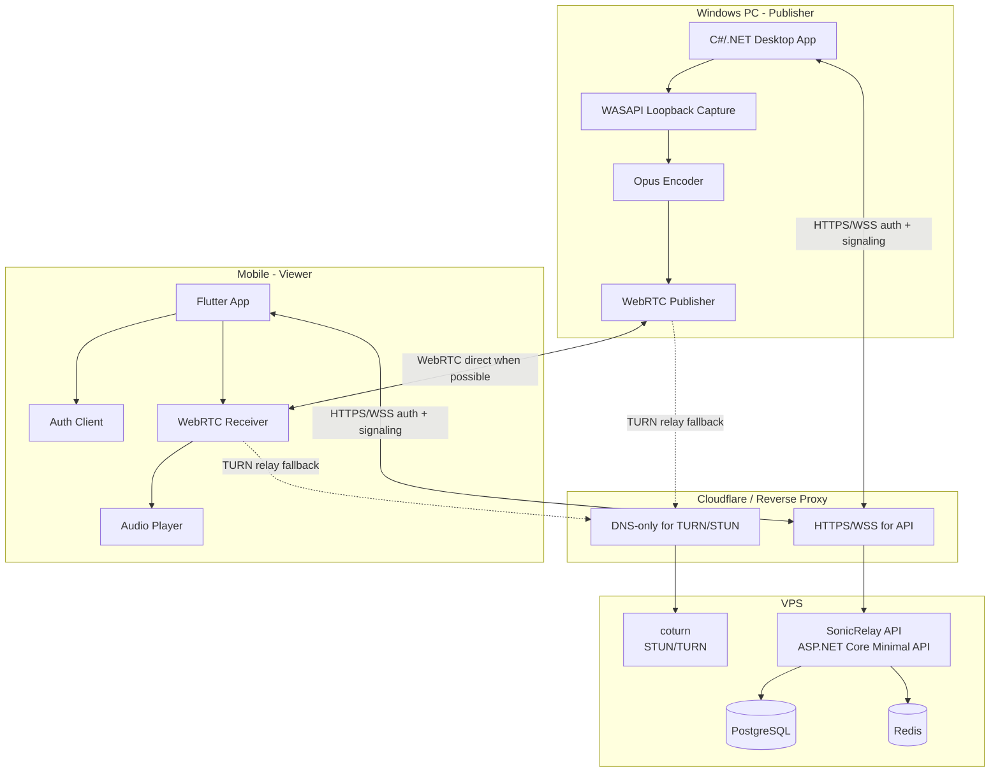
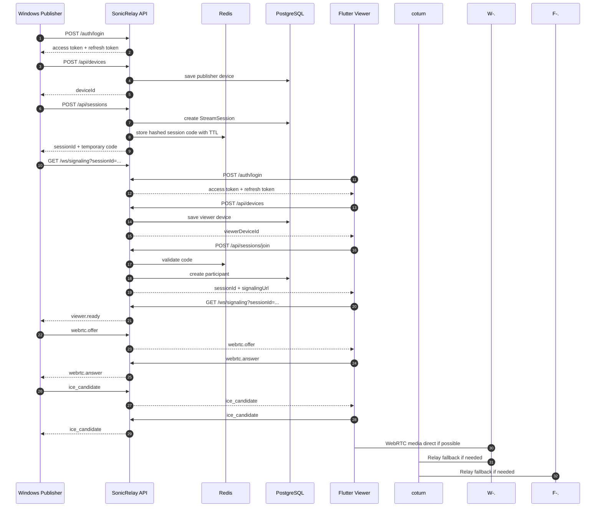
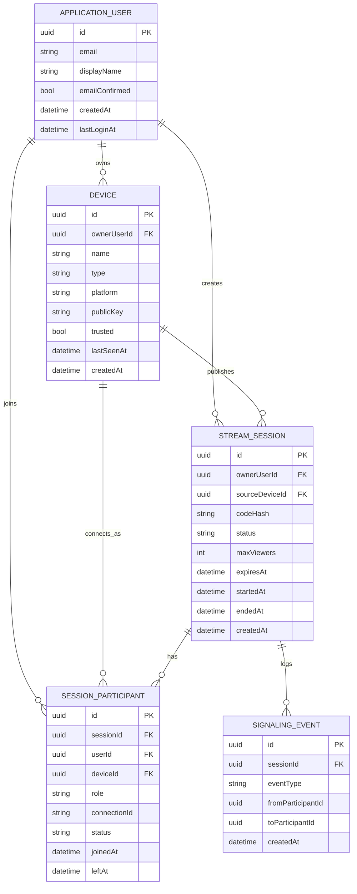
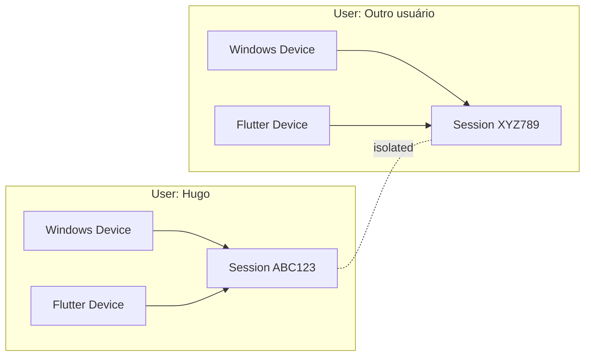
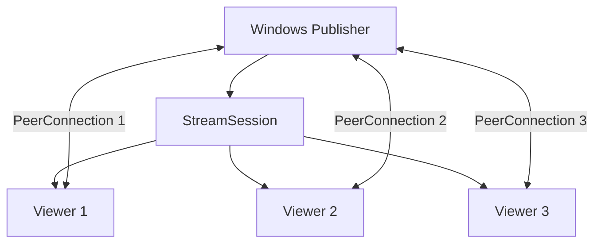

# SonicRelay

> Backend/control-plane para streaming de áudio de baixa latência entre um PC Windows e clientes mobile, usando ASP.NET Core Minimal API, PostgreSQL, Redis, WebSocket signaling, WebRTC, Opus e coturn.

SonicRelay existe para resolver um problema bem específico: transmitir o áudio do PC Windows para outro dispositivo com baixa latência, autenticação, múltiplos usuários, múltiplas máquinas e sessões isoladas. Sim, aparentemente ouvir o próprio PC em outro aparelho exige quase uma pequena agência espacial. 🚀

## Suite do projeto

| Projeto | Repositório | Stack | Papel |
| --- | --- | --- | --- |
| Backend API | [dotnet_SonicRelay](https://github.com/vitorhugo-java/dotnet_SonicRelay) | .NET 10, ASP.NET Core Minimal API, PostgreSQL, Redis, Docker | Control-plane: auth, devices, sessions, session code e signaling WebSocket. |
| Mobile Viewer | [flutter_SonicRelay](https://github.com/vitorhugo-java/flutter_SonicRelay) | Flutter, flutter_webrtc | App mobile que entra em uma sessão e recebe/reproduz o áudio via WebRTC. |
| Windows Publisher | [windows_SonicRelay](https://github.com/vitorhugo-java/windows_SonicRelay) | C#/.NET Desktop, WASAPI loopback, WebRTC, Opus | App Windows que captura o áudio do sistema e publica a stream para os viewers. |

> Os repositórios Flutter e Windows estão linkados como parte da suite planejada. Este repositório contém o backend .NET.

## Status atual

Este PR inicializa o backend e a infraestrutura base. Algumas rotas ainda são contratos/stubs, porque a realidade infelizmente insiste em exigir implementação depois da arquitetura.

| Área | Status | Observação |
| --- | --- | --- |
| Solution .NET | ✅ Base criada | `SonicRelay.sln`, projetos de API, Domain, Application e Infrastructure. |
| Minimal API | ✅ Skeleton | Startup com Swagger, health checks, auth policies, WebSockets e endpoints agrupados. |
| PostgreSQL | ✅ Infra base | EF Core/Npgsql configurado via `AppDbContext`. |
| Redis | ✅ Infra base | Usado para cache/session code store no desenho atual. |
| Devices | 🟡 Contrato inicial | Endpoints e domínio base. |
| Sessions | 🟡 Contrato inicial | Endpoints e modelos base. |
| WebSocket signaling | 🟡 Skeleton | Endpoint autenticado criado, roteamento real ainda pendente. |
| Identity/Auth real | 🔴 Pendente | Rotas `/auth` existem, mas a integração completa com Identity/tokens ainda precisa ser implementada. |
| WebRTC media | 🔴 Fora deste repo | A mídia deve ficar nos apps Windows/Flutter, não no backend. |
| CI/CD VPS | ✅ Base criada | Workflow separado em build, test, publish image e deploy over SSH. |

## Decisão técnica principal

O backend **não é media server**. Ele não transcodifica, não mistura áudio, não segura buffer de mídia e não tenta brincar de Discord caseiro dentro da VPS.

Ele faz o que backend deve fazer:

- autenticar usuários;
- registrar dispositivos;
- criar sessões;
- emitir e validar códigos temporários de sessão;
- validar permissões;
- fazer signaling WebSocket para WebRTC;
- registrar eventos básicos;
- expor health checks e operar via Docker.

A mídia deve trafegar por **WebRTC Media Track com Opus**, diretamente entre os peers quando possível, ou via **coturn** quando NAT/firewall estragar a festa, como sempre.

## Arquitetura geral



## Responsabilidades por componente

### Backend API

Responsável por:

- auth e sessão do usuário;
- cadastro e confiança de devices;
- criação, expiração e encerramento de `StreamSession`;
- geração de `SessionCode` temporário;
- autorização para publisher/viewer;
- signaling WebSocket;
- health checks;
- infraestrutura Docker para dev/prod.

Não responsável por:

- capturar áudio;
- codificar áudio;
- transmitir mídia;
- fazer relay de mídia;
- substituir coturn;
- virar um monólito multimídia triste.

### Windows Publisher

Responsável por:

- autenticar no backend;
- registrar o PC como device;
- capturar áudio do sistema via WASAPI loopback;
- codificar áudio em Opus;
- criar sessão de stream;
- abrir WebSocket de signaling;
- criar uma `RTCPeerConnection` por viewer;
- encerrar a sessão corretamente.

### Flutter Viewer

Responsável por:

- autenticar no backend;
- registrar o celular como device;
- entrar na sessão por código;
- abrir WebSocket de signaling;
- receber offer/answer/ICE candidates;
- reproduzir áudio WebRTC;
- mostrar estado da conexão, latência estimada e reconexão.

## Fluxo principal



## Modelo de domínio



## Estrutura do repositório

```text
.
├── .github/
│   └── workflows/
│       └── vps-ci-cd.yml
├── deploy/
│   ├── deploy.sh
│   └── docker-compose.prod.yml
├── docs/
│   └── deployment-vps-ssh.md
├── infra/
│   ├── .env.example
│   ├── .env.prod.example
│   ├── compose.yml
│   ├── compose.dev.yml
│   ├── compose.prod.yml
│   ├── coturn/
│   │   └── turnserver.conf
│   └── nginx/
│       └── default.conf
├── services/
│   └── SonicRelay.Api/
│       ├── Endpoints/
│       ├── Dockerfile
│       └── SonicRelay.Api.csproj
├── src/
│   ├── SonicRelay.Application/
│   ├── SonicRelay.Domain/
│   └── SonicRelay.Infrastructure/
├── Dockerfile
├── SonicRelay.sln
└── README.md
```

## Stack

| Camada | Tecnologia |
| --- | --- |
| Runtime | .NET 10 |
| API | ASP.NET Core Minimal API |
| Auth planejado | ASP.NET Core Identity + token-based auth |
| Persistência | PostgreSQL |
| Cache/ephemeral store | Redis |
| ORM | Entity Framework Core + Npgsql |
| Signaling | ASP.NET Core WebSockets |
| Mídia | WebRTC + Opus nos clients |
| NAT traversal | coturn/STUN/TURN |
| Local dev | Docker Compose profiles |
| Deploy | GHCR + Docker Compose + SSH VPS |

## Endpoints previstos

### Auth

| Método | Endpoint | Status | Descrição |
| --- | --- | --- | --- |
| `POST` | `/auth/register` | Stub | Cadastro de usuário. |
| `POST` | `/auth/login` | Stub | Login e emissão de tokens. |
| `POST` | `/auth/refresh` | Stub | Renovação de access token. |
| `POST` | `/auth/logout` | Stub protegido | Encerrar sessão/token. |
| `GET` | `/auth/me` | Stub protegido | Dados do usuário autenticado. |

### Devices

| Método | Endpoint | Descrição |
| --- | --- | --- |
| `POST` | `/api/devices` | Registrar um device do usuário. |
| `GET` | `/api/devices` | Listar devices do usuário. |
| `GET` | `/api/devices/{deviceId}` | Buscar device específico. |
| `PATCH` | `/api/devices/{deviceId}` | Atualizar nome/metadados/confiança. |
| `DELETE` | `/api/devices/{deviceId}` | Revogar/remover device. |

### Sessions

| Método | Endpoint | Descrição |
| --- | --- | --- |
| `POST` | `/api/sessions` | Criar sessão como publisher. |
| `GET` | `/api/sessions/active` | Listar sessões ativas do usuário. |
| `GET` | `/api/sessions/{sessionId}` | Buscar sessão. |
| `POST` | `/api/sessions/{sessionId}/end` | Encerrar sessão. |
| `POST` | `/api/sessions/{sessionId}/rotate-code` | Rotacionar código temporário. |
| `POST` | `/api/sessions/join` | Entrar em sessão via código. |

### WebSocket signaling

```text
GET /ws/signaling?sessionId={sessionId}&deviceId={deviceId}
Authorization: Bearer <access_token>
```

Mensagens previstas:

```text
session.joined
session.left
publisher.ready
viewer.ready
webrtc.offer
webrtc.answer
webrtc.ice_candidate
session.ended
error
ping
pong
```

Envelope base:

```json
{
  "type": "webrtc.offer",
  "messageId": "018f8d6e-2d5b-7b91-93a2-3ec8a2f0f1ab",
  "sessionId": "018f8d6e-2d5b-7b91-93a2-3ec8a2f0f1ac",
  "from": "018f8d6e-2d5b-7b91-93a2-3ec8a2f0f1ad",
  "to": "018f8d6e-2d5b-7b91-93a2-3ec8a2f0f1ae",
  "timestamp": "2026-07-03T14:00:00-03:00",
  "payload": {}
}
```

## Auth e autorização

Políticas previstas no backend:

```text
AuthenticatedUser
CanRegisterDevice
CanCreateSession
CanJoinSession
CanPublishSession
CanViewSession
AdminOnly
```

Regras importantes:

- Toda rota privada exige token válido.
- WebSocket deve validar autenticação antes de aceitar conexão.
- Usuário só pode listar/manipular seus próprios devices.
- Publisher só pode criar sessão para device próprio.
- Viewer só entra com código válido e dentro do limite da sessão.
- Código de sessão deve ser armazenado com hash, nunca texto puro.
- Código de sessão deve expirar automaticamente.
- Logs de produção não devem gravar SDP completo nem ICE candidates sensíveis.

## Session code

Configuração sugerida para MVP:

| Config | Valor inicial |
| --- | --- |
| Tamanho | 6 caracteres alfanuméricos |
| Exemplo | `ABC123` |
| TTL | 10 minutos |
| Tentativas | 5 por minuto por IP/usuário |
| Persistência | Redis com hash/HMAC e expiração |
| Rotação | Manual por endpoint ou automática ao expirar |

Código curto é melhor para UX. Código gigante é tecnicamente mais bonito, mas humanos digitam errado até CPF próprio.

## Multiusuário e isolamento



Um publisher pode atender mais de um viewer criando uma `PeerConnection` por viewer:



Limites iniciais recomendados:

```text
maxViewersPerSession: 2-3
maxActiveSessionsPerUser: 3
sessionCodeTtlMinutes: 10
sessionIdleTimeoutMinutes: 5
accessTokenLifetimeMinutes: 15
refreshTokenLifetimeDays: 30
```

Se passar de 3-5 viewers por publisher, considerar SFU/media server. Antes disso é overengineering, aquele hobby premium de dev cansado.

## Latência alvo

| Cenário | Latência esperada |
| --- | --- |
| WebRTC direto via UDP | 120ms - 250ms |
| TURN UDP | 200ms - 500ms |
| Rede corporativa ruim | 500ms - 1000ms |
| TURN TCP/TLS fallback | 600ms - 1500ms |

Métricas que os clients devem exibir/coletar:

- ICE connection state;
- selected candidate pair;
- RTT estimado;
- packet loss;
- jitter;
- codec ativo;
- bitrate aproximado;
- direct vs relay mode.

## Docker Compose

A infra usa compose base + overrides por profile.

### Dev

```bash
cp infra/.env.example infra/.env

docker compose \
  --env-file infra/.env \
  -f infra/compose.yml \
  -f infra/compose.dev.yml \
  --profile dev \
  up --build
```

Com ferramentas extras:

```bash
docker compose \
  --env-file infra/.env \
  -f infra/compose.yml \
  -f infra/compose.dev.yml \
  --profile dev \
  --profile dev-tools \
  up --build
```

Serviços esperados no dev:

| Serviço | Porta |
| --- | --- |
| API | `http://localhost:8080` |
| PostgreSQL | `localhost:5432` |
| Redis | `localhost:6379` |
| pgAdmin | `http://localhost:5050` |
| RedisInsight | `http://localhost:5540` |
| coturn | `3478/udp`, `3478/tcp`, `5349/tcp` |

### Prod

O deploy de produção usa imagem publicada no GHCR e compose em `deploy/`.

Fluxo esperado:

```text
Build -> Test -> Publish public GHCR image -> Deploy over SSH
```

Workflow:

```text
.github/workflows/vps-ci-cd.yml
```

Secrets esperados:

```text
VPS_HOST
VPS_USER
VPS_SSH_KEY
VPS_PORT
VPS_APP_DIR
```

## Cloudflare / DNS

Configuração sugerida:

| Host | Proxy | Uso |
| --- | --- | --- |
| `stream.example.com` | Orange cloud | API HTTPS + WebSocket Secure. |
| `turn.example.com` | DNS-only | STUN/TURN direto para a VPS. |

TURN/STUN não deve ficar atrás do proxy HTTP comum da Cloudflare. A API gosta de HTTPS/WSS. O TURN gosta de UDP/TCP próprios. Eles têm gostos diferentes, como qualquer stack que quer estragar sua sexta-feira.

Portas sugeridas:

```text
443/tcp              API HTTPS/WSS
3478/udp             TURN UDP
3478/tcp             TURN TCP fallback
5349/tcp             TURNS fallback
49160-49200/udp      Relay ports reduzidas para MVP
```

## Quick start local sem Docker

Requisitos:

- .NET 10 SDK;
- PostgreSQL;
- Redis.

Comandos:

```bash
dotnet restore SonicRelay.sln
dotnet build SonicRelay.sln

dotnet run --project services/SonicRelay.Api/SonicRelay.Api.csproj
```

Health checks:

```bash
curl http://localhost:8080/health/live
curl http://localhost:8080/health/ready
```

## Variáveis de ambiente principais

| Variável | Exemplo | Descrição |
| --- | --- | --- |
| `ASPNETCORE_ENVIRONMENT` | `Development` | Ambiente da API. |
| `ASPNETCORE_URLS` | `http://+:8080` | Binding HTTP interno. |
| `ConnectionStrings__Postgres` | `Host=postgres;Port=5432;Database=sonicrelay;...` | String de conexão do PostgreSQL. |
| `Redis__ConnectionString` | `redis:6379,password=change-me,abortConnect=false` | String de conexão do Redis. |
| `Auth__AccessTokenMinutes` | `15` | TTL do access token. |
| `Auth__RefreshTokenDays` | `30` | TTL do refresh token. |
| `Sessions__CodeTtlMinutes` | `10` | TTL do código temporário da sessão. |
| `Sessions__MaxViewersPerSession` | `3` | Limite inicial de viewers por sessão. |

## Segurança mínima para MVP

Checklist obrigatório antes de considerar produção minimamente decente:

- [ ] Implementar ASP.NET Core Identity real.
- [ ] Configurar token-based auth para clients desktop/mobile.
- [ ] Validar Bearer token no WebSocket antes de aceitar conexão.
- [ ] Hash/HMAC para session code.
- [ ] Rate limiting em login, refresh, create session e join.
- [ ] Expiração automática de sessões e participants desconectados.
- [ ] Não logar payload sensível de SDP/ICE em produção.
- [ ] CORS restritivo.
- [ ] Secrets fora do repositório.
- [ ] TURN com credenciais temporárias, se possível.
- [ ] Backups do PostgreSQL.
- [ ] Health checks e logs estruturados.

## Roadmap

### Fase 1 - Backend base

- [x] Criar solution e projetos.
- [x] Criar Minimal API.
- [x] Configurar PostgreSQL.
- [x] Configurar Redis.
- [x] Criar compose base/dev/prod.
- [ ] Implementar Identity real.
- [ ] Implementar migrations.
- [ ] Implementar endpoints reais de auth.

### Fase 2 - Devices e sessions

- [ ] Implementar CRUD de devices.
- [ ] Implementar criação de sessão.
- [ ] Implementar join por código.
- [ ] Implementar expiração de sessão.
- [ ] Implementar participant lifecycle.

### Fase 3 - Signaling

- [x] Criar endpoint WebSocket skeleton.
- [ ] Implementar registry real de conexões.
- [ ] Roteamento `offer`, `answer`, `ice_candidate`.
- [ ] Heartbeat `ping/pong`.
- [ ] Cleanup de conexões mortas.

### Fase 4 - Mobile Flutter

- [ ] Login.
- [ ] Registro de device.
- [ ] Entrada por código.
- [ ] WebSocket signaling.
- [ ] WebRTC receiver.
- [ ] Player e status da conexão.

### Fase 5 - Windows Publisher

- [ ] Login.
- [ ] Registro de device.
- [ ] Captura WASAPI loopback.
- [ ] Opus/WebRTC publisher.
- [ ] Uma PeerConnection por viewer.
- [ ] UI/log simples.

### Fase 6 - Hardening

- [ ] Rate limiting.
- [ ] Trusted devices.
- [ ] Revogação de device.
- [ ] TURN credentials temporárias.
- [ ] Observabilidade.
- [ ] Alertas.

## ADRs iniciais

| ADR | Decisão |
| --- | --- |
| ADR-001 | Usar WebRTC + Opus para baixa latência. |
| ADR-002 | Usar ASP.NET Core Minimal API como control-plane. |
| ADR-003 | Usar ASP.NET Core Identity no MVP em vez de Keycloak. |
| ADR-004 | Backend faz signaling, não media relay. |
| ADR-005 | coturn separado e DNS-only, não atrás de proxy HTTP comum. |
| ADR-006 | Session code é autorização temporária, não substitui login. |
| ADR-007 | Uma PeerConnection por viewer no MVP. |

## Critérios de aceite

### Backend

- Usuário registra e autentica.
- Access token protege endpoints privados.
- Refresh token renova sessão.
- Device pertence ao usuário correto.
- Session code expira.
- Session code errado não revela detalhes sensíveis.
- WebSocket rejeita usuário não autenticado.
- WebSocket rejeita participante fora da sessão.
- Múltiplas sessões simultâneas não interferem entre si.

### Flutter

- Usuário faz login.
- Usuário entra em sessão por código.
- App recebe signaling.
- App reproduz áudio WebRTC.
- App mostra estado da conexão.
- App reconecta WebSocket se cair.

### Windows

- App roda sem admin.
- App captura áudio do sistema via WASAPI loopback.
- App cria sessão.
- App aceita viewer.
- App cria uma PeerConnection por viewer.
- App encerra sessão corretamente.

### Infra

- API acessível via HTTPS/WSS.
- TURN acessível via DNS-only.
- Compose dev sobe localmente.
- Compose prod roda na VPS.
- GHCR publica imagem pública.
- Deploy SSH atualiza a VPS.

## Referências técnicas

- [ASP.NET Core Identity API endpoints](https://learn.microsoft.com/en-us/aspnet/core/security/authentication/identity-api-authorization)
- [Authentication and authorization in Minimal APIs](https://learn.microsoft.com/en-us/aspnet/core/fundamentals/minimal-apis/security)
- [ASP.NET Core WebSockets](https://learn.microsoft.com/en-us/aspnet/core/fundamentals/websockets)
- [WASAPI loopback recording](https://learn.microsoft.com/en-us/windows/win32/coreaudio/loopback-recording)
- [Flutter WebRTC package](https://pub.dev/packages/flutter_webrtc)
- [WebRTC TURN server guide](https://webrtc.org/getting-started/turn-server)
- [Opus RFC 6716](https://www.rfc-editor.org/rfc/rfc6716)
