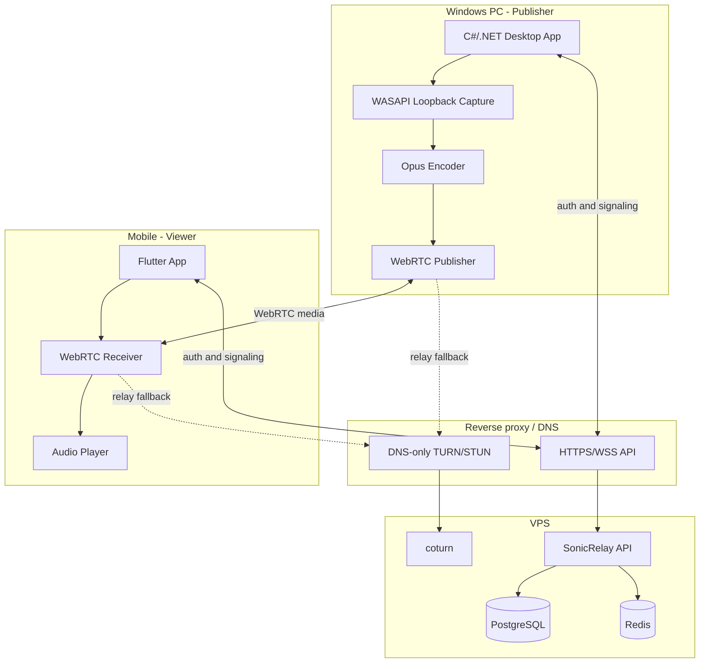
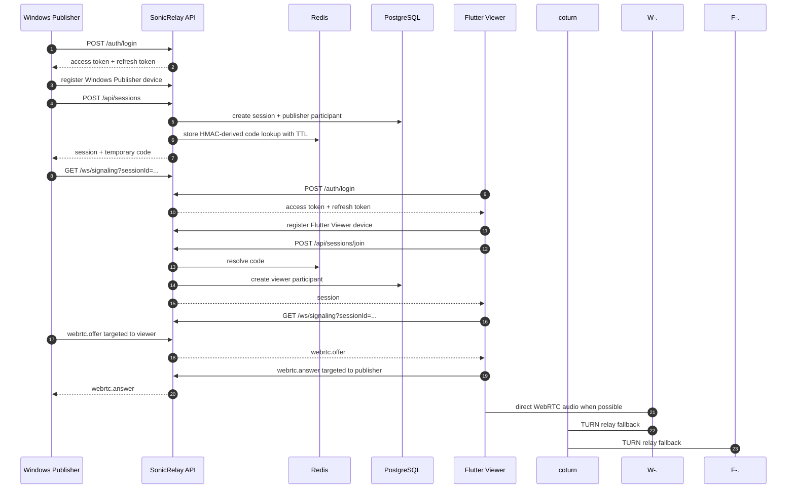
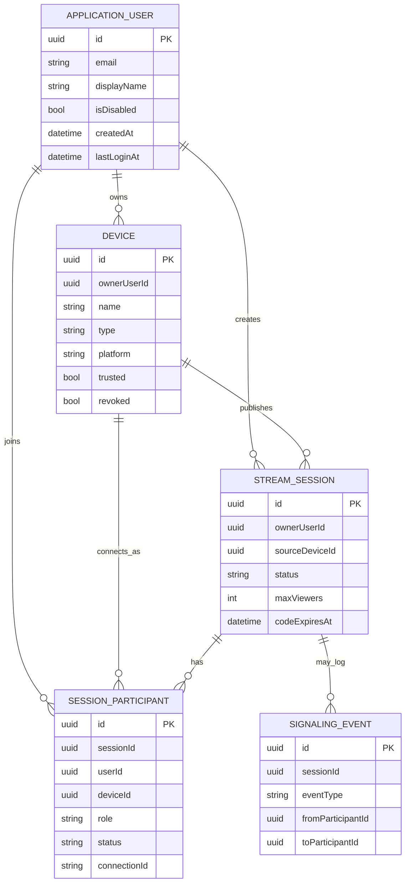
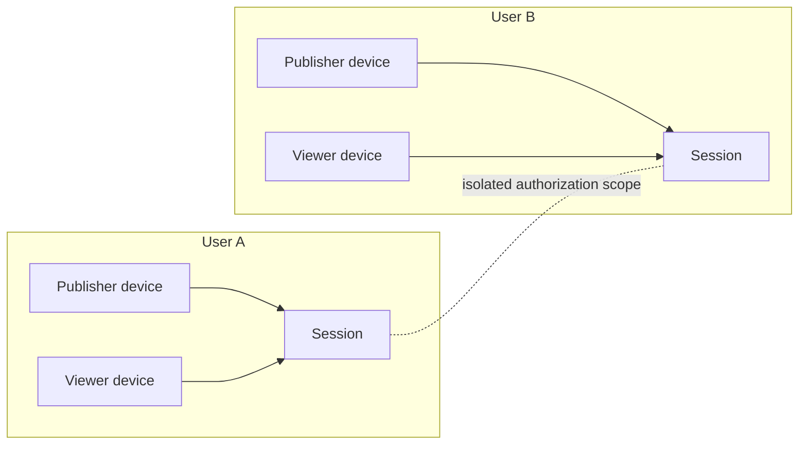
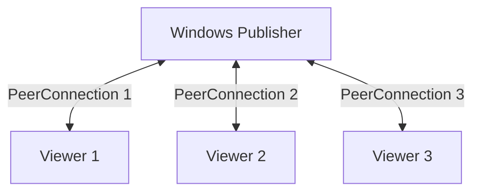

# Architecture

## System boundary

SonicRelay is a control plane. It authenticates users, persists session state, issues temporary join codes and routes WebRTC signaling messages. It does not capture, encode, buffer, transcode or relay audio. Media flows directly between clients when possible and through coturn when NAT traversal requires it.

## Components

- `services/SonicRelay.Api`: Minimal API composition, rate limits, health checks, endpoint handlers, WebSocket signaling and session cleanup.
- `src/SonicRelay.Domain`: user, device, session, participant and signaling-event models, and (Phase 1 of issue #26) a parallel device-identity credential and pairing model — see `docs/device-identity.md`. `StreamSession.SourceDeviceId` and `SessionParticipant.DeviceId` now reference `DeviceIdentity` rather than `ApplicationUser`/the old `Device` entity (Phase 2 of issue #26); `Device` is no longer part of the session, signaling or TURN path and remains only for its own unrelated, owner-scoped CRUD feature, pending Phase 4 cleanup.
- `src/SonicRelay.Application`: abstractions for session-code storage and live connection routing.
- `src/SonicRelay.Infrastructure`: EF Core/PostgreSQL persistence, Identity stores, Redis session-code storage and the in-memory connection registry.
- `infra`: development and full-stack production Compose definitions, nginx and coturn configuration.
- `deploy`: API-only production Compose file and SSH deployment script used by GitHub Actions.

The signaling registry is process-local. Multiple API replicas do not share live WebSocket registrations, so horizontal scaling requires sticky routing or a distributed signaling backplane.

## Primary flow

Device endpoints persist owner-scoped Windows Publisher and Flutter Viewer records. Session creation and join validate those devices before admitting participants.

## Persistence model

EF Core maps these tables but does not declare relational foreign-key navigation constraints in `AppDbContext`; ownership and membership checks are enforced by handlers.

## Session and peer topology

Users only see sessions they own or participate in. A publisher is expected to create one peer connection per viewer.

## Decision records

- [ADR 0001: Keep media outside the backend](adr/0001-control-plane-only.md)
- [ADR 0002: Use Identity opaque bearer tokens](adr/0002-identity-bearer-tokens.md)
- [ADR 0003: Split durable and ephemeral storage](adr/0003-postgresql-and-redis-storage.md)
- [ADR 0004: Use authenticated WebSocket signaling](adr/0004-authenticated-websocket-signaling.md)
- [ADR 0005: Symmetric device credentials with a parallel DeviceBearer scheme](adr/0005-device-identity-credentials.md) — extended in Phase 2 to sessions, signaling and TURN credential issuance
